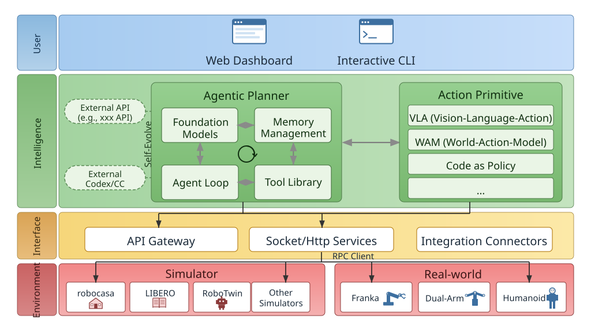

<div align="center">
  
  <h1>RPent: Agentic Infrastructure for the Physical World</h1>
</div>

<div align="center">

[](README.md)
[](README.zh-CN.md)
[](https://github.com/RLinf/RPent)
[](docs/README.md)
[](LICENSE)

</div>

<div align="center">
  
</div>

RPent (Recursive Physical Agent) is an open framework for building embodied agents that continuously evolve through recursive interaction with the physical world. Rather than prescribing a single foundation model, RPent provides a recursive agent framework that harnesses heterogeneous intelligence, including perception, reasoning, memory, execution, and self-evolution, into a unified physical agent. Through continuous interaction, reflection, and adaptation, RPent enables physical agents to acquire new capabilities and evolve beyond their initial design.

The name **Pent** is inspired by the **Pentagram**, whose five points symbolize the integration of multimodal intelligence into a unified embodied agent. At its center, the infinity symbol (**∞**) represents the endless recursive cycle of perception, reasoning, execution, and self-evolution, through which intelligence continuously expands into the physical world.

RPent is built upon three core design principles: **Service-oriented**, **Standardized**, and **Composable**. RPent enables capabilities to be deployed as reusable services, connected through unified interfaces, and flexibly composed into diverse physical agents. Together, these principles allow RPent to move beyond traditional robot control frameworks and establish an **Agentic Infrastructure for the Physical World**, where intelligence is not only deployed, but continuously built, expanded, and evolved.

## Supported Environments

<table style="width: 100%; table-layout: auto; border-collapse: collapse;">
  <thead align="center" valign="bottom">
    <tr>
      <th style="text-align: left;">Simulator</th>
      <th>VLA Policy</th>
      <th>Reasoning Brain</th>
    </tr>
  </thead>
  <tbody valign="top">
    <tr>
      <td style="text-align: left; padding-left: 8px;">
        <ul style="margin-left: 0; padding-left: 16px;">
          <li><b>LIBERO</b> (standard / pro / plus) ✅</li>
          <ul>
            <li>libero_object · _task / _swap / _lan</li>
            <li>libero_goal · _task / _swap / _lan</li>
            <li>libero_spatial · _task / _lan</li>
            <li>libero_10 · _task / _swap / _lan</li>
          </ul>
          <li><b>RoboCasa</b> (kitchen, long-horizon) ✅</li>
          <ul>
            <li>PickPlace* · Open/Close* · TurnOn/Off* …</li>
          </ul>
        </ul>
      </td>
      <td>
        <ul style="margin-left: 0; padding-left: 16px;">
          <li><b>Pi0.5</b> (LIBERO, HTTP) ✅</li>
          <li><b>RLDX-1</b> (RoboCasa, socket-RPC) ✅</li>
        </ul>
      </td>
      <td>
        <ul style="margin-left: 0; padding-left: 16px;">
          <li><b>api</b> — pydantic-ai ✅</li>
          <ul>
            <li>Anthropic (Claude) ✅</li>
            <li>OpenAI (responses) ✅</li>
            <li>OpenAI-compatible (chat) ✅</li>
          </ul>
          <li><b>claude_code</b> — Claude Agent SDK ✅</li>
          <li><b>codex</b> — OpenAI Codex SDK ✅</li>
        </ul>
      </td>
    </tr>
  </tbody>
</table>

## Quick Start

RPent runs on top of a forked branch of [RLinf](https://github.com/RLinf/RLinf) for the simulators and VLA models. Clone them side by side.

**1. Clone RLinf and RPent side by side.**

```bash
mkdir workspace && cd workspace
# RPent depends on a forked branch of RLinf; it will be merged back to main after more iterations.
git clone https://github.com/jx-qiu/RLinf -b feature/physicalagent rlinf
git clone https://github.com/RLinf/RPent rpent
```

**2. In RLinf, create an openpi + LIBERO virtualenv.**

```bash
cd rlinf
bash requirements/install.sh embodied --env libero --model openpi --use-mirror --venv ../.venv-opi-libero
cd ..
source .venv-opi-libero/bin/activate
```

**3. Install RPent's extra dependencies on top of that venv.**

```bash
cd rpent
uv sync --active --inexact
bash scripts/install_libero_pro_plus.sh
```

**4. Configure keys and checkpoints, then run.**

```bash
# LLM API keys (the `api` cerebrum)
export ANTHROPIC_BASE_URL=https://xxx
export ANTHROPIC_API_KEY=sk-xxx
export OPENAI_BASE_URL=https://xxx
export OPENAI_API_KEY=sk-xxx

# VLA checkpoint — download from
# https://huggingface.co/datasets/RLinf/rlinf-pi05-libero-130-fullshot-sft
export PI05_CHECKPOINT_PATH=/path/to/rlinf-pi05-libero-130-fullshot-sft
export LIBERO_TYPE=pro
export CUDA_DEVICE=0

# Run one task: libero_object_swap, task 2, seed 0, using the `api` cerebrum
# with an Anthropic model and an 8192-token cap.
#   • OpenAI-compatible chat endpoints:  --model openai-chat:glm-5.2
#   • OpenAI responses endpoints:        --model openai:gpt-5.5
#   • claude_code / codex cerebrums:     no provider prefix, e.g. --model claude-opus-4-8
python rpent/cli/main.py --suite libero_object_swap --task 2 --seed 0 \
  --cerebrum api --model anthropic:claude-opus-4-8 --max_tokens 8192
```

### Live Dashboard

Add `--dashboard` to open a browser monitor for the run. It boots a launcher screen where you pick the config, then streams reasoning, live views, and the action timeline. Use `--dashboard_language zh-cn` for the Chinese UI.

```bash
python rpent/cli/main.py --dashboard --dashboard_language zh-cn \
  --suite libero_goal_task --task 1 --seed 0 --cerebrum claude_code
```

### RoboCasa

RoboCasa uses a separate entrypoint and setup guide.

```bash
bash scripts/setup_robocasa.sh                                # one-time setup
bash scripts/run_robocasa.sh PickPlaceCounterToCabinet 0 0    # <task> <gpu> <seed>
```

See [SETUP_ROBOCASA.zh.md](docs/SETUP_ROBOCASA.zh.md) for the full RoboCasa365 + RLDX-1 walkthrough.

## Key CLI Options

| Flag | Default | Description |
| --- | --- | --- |
| `--suite` | — (required) | Task suite, e.g. `libero_object_task`, `libero_spatial_swap` |
| `--task` | — (required) | Task id within the suite |
| `--seed` | `0` | Random seed |
| `--cerebrum` | `api` | Reasoning brain: `api` \| `claude_code` \| `codex` |
| `--model` | — | Model id; for `api`, prefix the provider (`anthropic:…`, `openai:…`, `openai-chat:…`) |
| `--max_turns` | `100` | Max agent turns |
| `--max_tokens` | `8192` | Max tokens per LLM reply |
| `--max_episode_steps` | `600` | Max env steps (auto-raised to 5000 for `libero_10`) |
| `--libero_type` | auto | `standard` \| `pro` \| `plus` (routed from the suite suffix) |
| `--cuda_device` | `0` | GPU for the env / vla servers |
| `--dashboard` | off | Start the local dashboard for this run |
| `--dashboard_language` | `en` | Dashboard UI language: `en` \| `zh-cn` |
| `--vla_endpoint` | — | Reuse an already-running vla_server instead of spawning one |
| `--no-servers` | off | Attach to an existing env_server / vla_server |

## Documentation

- [Adding a new environment](docs/ADD_A_NEW_ENV.md) — plug a new simulator / robot into the runner ([中文](docs/ADD_A_NEW_ENV.zh.md)).
- [RoboCasa setup](docs/SETUP_ROBOCASA.zh.md) — RoboCasa365 + RLDX-1 install and run guide.
- [`docs/`](docs/README.md) — the full documentation index.

## Acknowledgements

RPent builds on the simulators, VLA models, and training infrastructure of [RLinf](https://github.com/RLinf/RLinf), and on the agent SDKs of the broader open-source community — [pydantic-ai](https://ai.pydantic.dev/), the [Claude Agent SDK](https://docs.claude.com/en/api/agent-sdk/overview), and the OpenAI Codex SDK. Thanks to the teams behind LIBERO, RoboCasa, robosuite, MuJoCo, and openpi.
